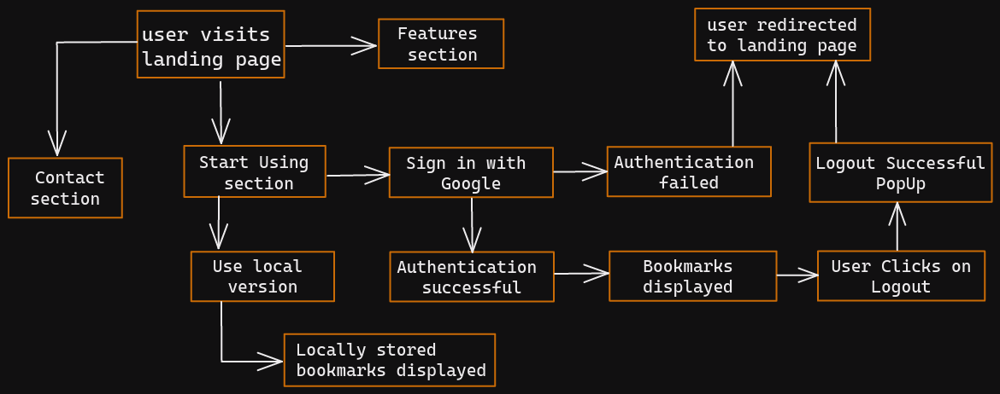

# Bookmark-Manager

## Description

This is a Mini Project for Semester 4 (currently pursuing) of Year 2 of Computer Engineering.   
Bookmark manager(v2) is a __Progressive Web App__ which allows you to manage your bookmarks from any device regardless of the operating system or browser being used.  
There are two versions of this project. I have simplified the difference between them with the help of the following table -

| Bookmark Manager    |       v1      |                   v2                  |
|---------------------|:-------------:|:-------------------------------------:|
| Toggle Theme        |       ✅       |                   ✅                   |
| Cloud Storage       |       ❌       |                   ✅                   |
| Sign In with Google |       ❌       |                   ✅                   |
| Drag and Drop       |       ❌       |                   ✅                   |
| Search Bookmark     |       ❌       |                   ✅                   |
| PWA                 |       ❌       |                   ✅                   |
| TechStack           | HTML, CSS, Js | React.js, Redux,  Firebase, Styled Components,  [muuri-react](https://paol-imi.github.io/muuri-react/) |

#### You can check the deployed version of the bookmark manager [here](https://bookmark-manager-2617.web.app/).
<!-- If you want to contribute to the project then checkout [CONTRIBUTING.md](https://github.com/vishal-codes/react-widgets/blob/main/CONTRIBUTING.md) . -->

 

## Project Flow

 

## Future Scope

The future scope of the project includes -
- Adding more options to sign in e.g. Sign in with Facebook, Sign in with Twitter, etc.
- An extension needs to be developed so that a user can add a bookmark more easily without leaving that web page thus removing the step of copying and pasting the website link.

 

## Project Maintainer 🛠

<table>
    <tbody>
        <td align="center"><a href="https://github.com/vishal-codes"> <b> Vishal Shinde </b></a> <a title="Code"> Web Developer</a> </td>  
    </tbody>
</table>

 
